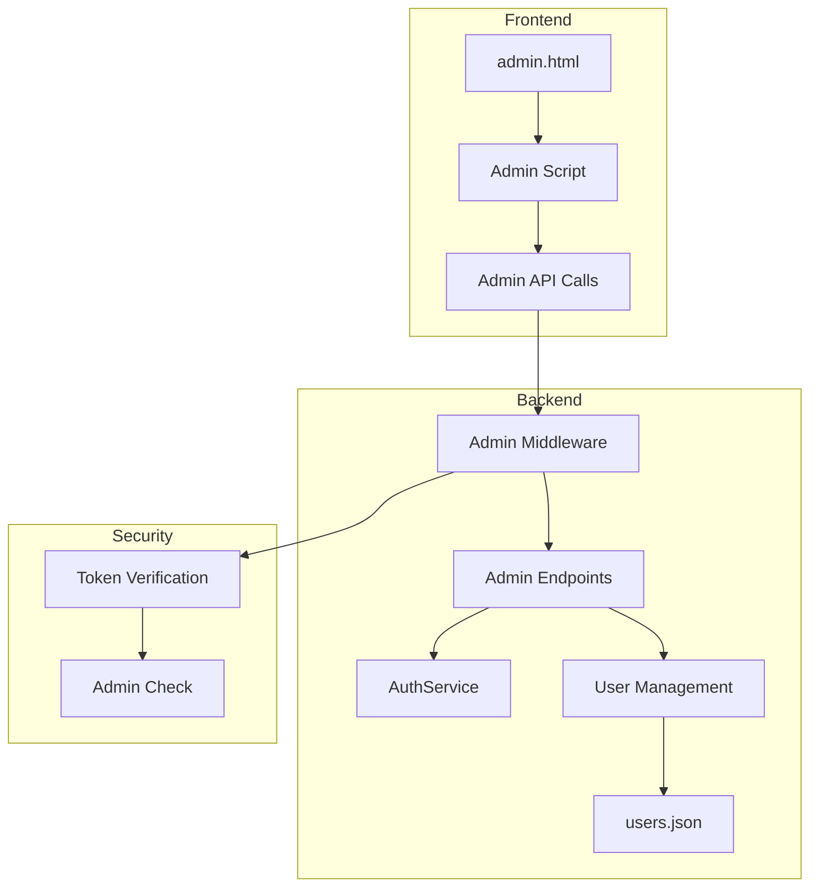

# Design Document: Admin Panel

## Overview

Bu tasarım, Niko AI Chat uygulamasına admin paneli eklemek için gerekli mimari ve bileşenleri tanımlar. Admin paneli, mevcut FastAPI backend'e yeni endpoint'ler ve static dosyalara yeni bir HTML sayfası eklenerek gerçekleştirilecektir.

## Architecture



## Components and Interfaces

### 1. AdminService (Backend)

Kullanıcı yönetimi işlemlerini gerçekleştiren servis sınıfı.

```python
class AdminService:
    def __init__(self, auth_service: AuthService):
        self.auth = auth_service
    
    def list_users(self) -> List[dict]:
        """Tüm kullanıcıları listele (şifre hariç)"""
        pass
    
    def get_user(self, username: str) -> dict:
        """Tek kullanıcı bilgisi getir"""
        pass
    
    def update_user(self, username: str, data: UserAdminUpdate) -> dict:
        """Kullanıcı bilgilerini güncelle"""
        pass
    
    def delete_user(self, username: str, admin_username: str) -> bool:
        """Kullanıcıyı ve geçmişini sil"""
        pass
    
    def create_user(self, user: UserAdminCreate) -> dict:
        """Admin tarafından kullanıcı oluştur"""
        pass
```

### 2. Admin API Endpoints

| Endpoint | Method | Description | Auth |
|----------|--------|-------------|------|
| `/api/admin/users` | GET | Tüm kullanıcıları listele | Admin |
| `/api/admin/users/{username}` | GET | Kullanıcı detayı | Admin |
| `/api/admin/users/{username}` | PUT | Kullanıcı güncelle | Admin |
| `/api/admin/users/{username}` | DELETE | Kullanıcı sil | Admin |
| `/api/admin/users` | POST | Yeni kullanıcı oluştur | Admin |
| `/admin` | GET | Admin panel sayfası | Admin |

### 3. Pydantic Models

```python
class UserAdminUpdate(BaseModel):
    """Admin tarafından kullanıcı güncelleme"""
    email: Optional[str] = None
    full_name: Optional[str] = None
    is_admin: Optional[bool] = None

class UserAdminCreate(BaseModel):
    """Admin tarafından kullanıcı oluşturma"""
    username: str
    password: str
    email: Optional[str] = None
    full_name: Optional[str] = None
    is_admin: bool = False

class UserListResponse(BaseModel):
    """Kullanıcı listesi yanıtı"""
    username: str
    email: Optional[str]
    full_name: Optional[str]
    is_admin: bool
    created_at: str
```

### 4. Admin Panel UI (admin.html)

- Responsive tablo ile kullanıcı listesi
- Modal formlar ile düzenleme/oluşturma
- Silme onay dialogu
- Sıralama ve filtreleme kontrolleri
- Mevcut style.css ile tutarlı tasarım

## Data Models

### Updated User Schema (users.json)

```json
{
  "username": {
    "password": "hashed_password",
    "email": "user@example.com",
    "full_name": "Ad Soyad",
    "is_admin": false,
    "created_at": "2026-01-09T10:00:00.000000"
  }
}
```

### Sample Users Data

```json
{
  "admin": {
    "password": "$2b$12$...",
    "email": "admin@nikoai.com",
    "full_name": "Sistem Yöneticisi",
    "is_admin": true,
    "created_at": "2026-01-01T00:00:00.000000"
  },
  "ahmet_yilmaz": {
    "password": "$2b$12$...",
    "email": "ahmet.yilmaz@email.com",
    "full_name": "Ahmet Yılmaz",
    "is_admin": false,
    "created_at": "2026-01-05T14:30:00.000000"
  },
  "elif_demir": {
    "password": "$2b$12$...",
    "email": "elif.demir@email.com",
    "full_name": "Elif Demir",
    "is_admin": false,
    "created_at": "2026-01-06T09:15:00.000000"
  },
  "mehmet_kaya": {
    "password": "$2b$12$...",
    "email": null,
    "full_name": "Mehmet Kaya",
    "is_admin": false,
    "created_at": "2026-01-07T16:45:00.000000"
  },
  "zeynep_ozturk": {
    "password": "$2b$12$...",
    "email": "zeynep@email.com",
    "full_name": "Zeynep Öztürk",
    "is_admin": true,
    "created_at": "2026-01-08T11:20:00.000000"
  },
  "can_arslan": {
    "password": "$2b$12$...",
    "email": "can.arslan@email.com",
    "full_name": "Can Arslan",
    "is_admin": false,
    "created_at": "2026-01-09T08:00:00.000000"
  }
}
```


## Correctness Properties

*A property is a characteristic or behavior that should hold true across all valid executions of a system-essentially, a formal statement about what the system should do. Properties serve as the bridge between human-readable specifications and machine-verifiable correctness guarantees.*

### Property 1: Admin Access Control

*For any* user attempting to access admin endpoints, access SHALL be granted if and only if the user has a valid token AND is_admin is true.

**Validates: Requirements 1.1, 1.2, 6.1, 6.2**

### Property 2: User List Completeness

*For any* admin request to list users, the response SHALL contain all users in the system, and each user object SHALL include username, email, full_name, created_at, and is_admin fields.

**Validates: Requirements 2.1, 2.2**

### Property 3: User Update Round-Trip

*For any* valid user update operation, getting the user after update SHALL return the updated values for email, full_name, and is_admin.

**Validates: Requirements 3.2, 3.3**

### Property 4: User Deletion Completeness

*For any* user deletion operation, after deletion the user SHALL NOT exist in the system AND all associated chat history files SHALL be removed.

**Validates: Requirements 4.2, 4.3**

### Property 5: User Creation Validation

*For any* user creation request, the system SHALL require username and password, SHALL accept optional email/full_name/is_admin, and SHALL apply the same validation rules as registration.

**Validates: Requirements 5.2, 5.3, 5.4**

### Property 6: Duplicate Username Prevention

*For any* user creation request with an existing username, the system SHALL return an error and NOT create a duplicate user.

**Validates: Requirements 5.5**

### Property 7: Self-Deletion Prevention

*For any* admin attempting to delete their own account, the system SHALL reject the request with an error.

**Validates: Requirements 4.4**

## Error Handling

| Error Condition | HTTP Status | Response |
|-----------------|-------------|----------|
| Invalid/expired token | 401 | `{"detail": "Geçersiz veya süresi dolmuş token"}` |
| Non-admin access | 403 | `{"detail": "Admin yetkisi gerekli"}` |
| User not found | 404 | `{"detail": "Kullanıcı bulunamadı"}` |
| Duplicate username | 400 | `{"detail": "Bu kullanıcı adı zaten kullanılıyor"}` |
| Self-deletion attempt | 400 | `{"detail": "Kendinizi silemezsiniz"}` |
| Validation error | 422 | `{"detail": [{"loc": [...], "msg": "...", "type": "..."}]}` |

## Testing Strategy

### Unit Tests
- Test admin middleware authorization logic
- Test user CRUD operations in AdminService
- Test validation rules for UserAdminCreate and UserAdminUpdate
- Test edge cases: self-deletion, duplicate usernames

### Property-Based Tests
Property-based testing will use Python's `hypothesis` library (already in use in the project).

- **Property 1**: Generate random users with/without admin status, verify access control
- **Property 2**: Generate random user sets, verify list completeness
- **Property 3**: Generate random update data, verify round-trip consistency
- **Property 4**: Generate users with history, verify complete deletion
- **Property 5**: Generate valid/invalid creation data, verify validation
- **Property 6**: Generate duplicate usernames, verify rejection
- **Property 7**: Generate admin self-delete attempts, verify rejection

Each property test will run minimum 100 iterations.

### Integration Tests
- Test full admin workflow: login → list → create → update → delete
- Test concurrent admin operations
- Test admin panel page loading with valid/invalid tokens
