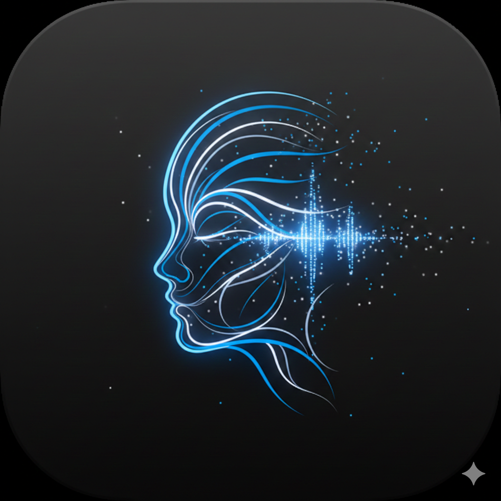
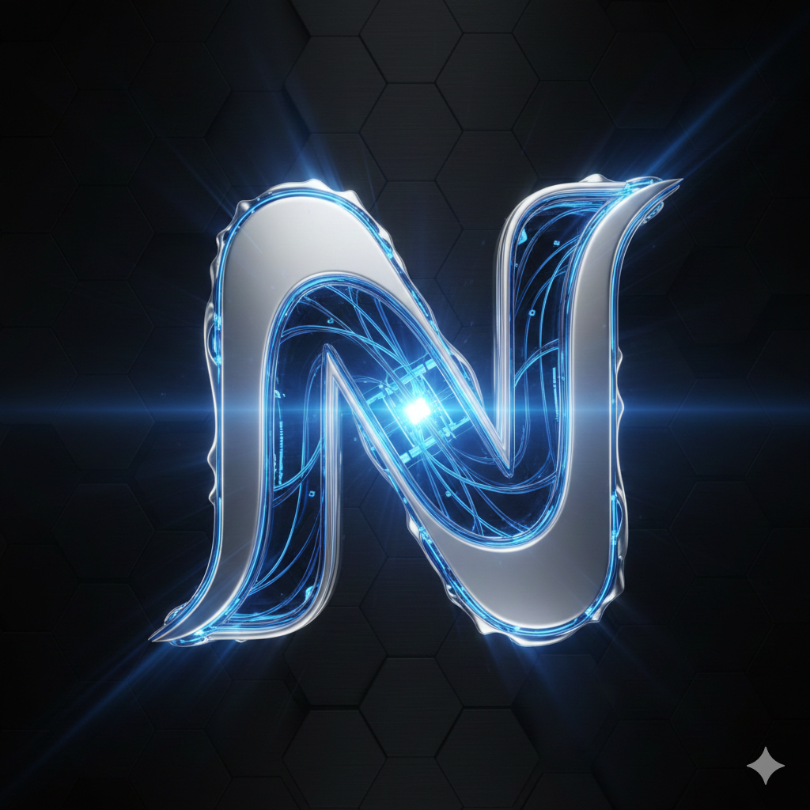
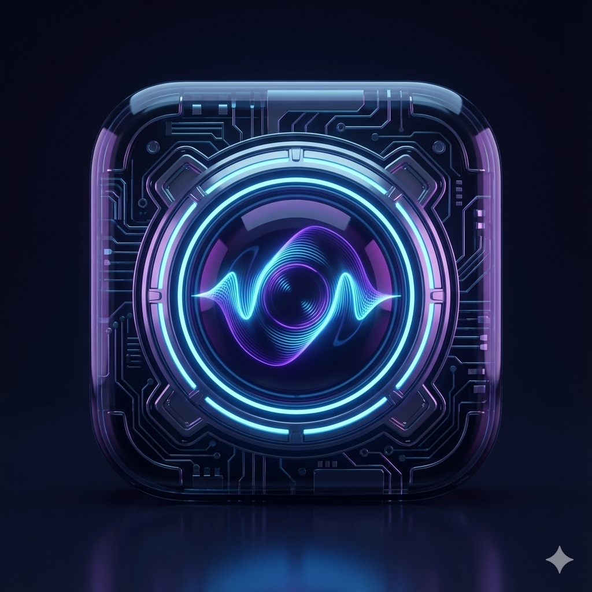
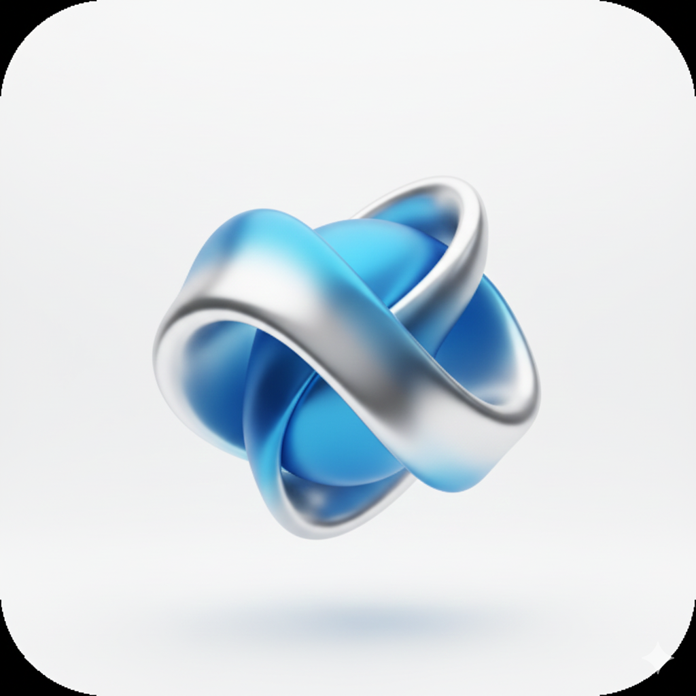
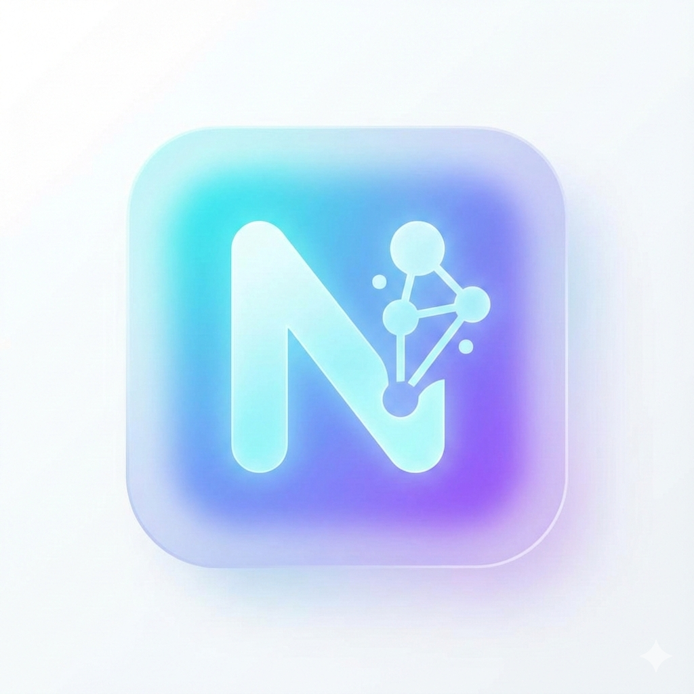
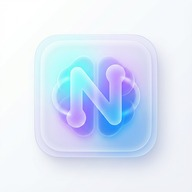

# Niko Mobile App

Niko, Android cihazlar için geliştirilmiş, sesli komutlarla çalışan kişisel bir yapay zeka asistanıdır. Gelişmiş ses tanıma özellikleri ve yapay zeka entegrasyonu sayesinde telefonunuzu dokunmadan kontrol etmenizi sağlar.

## ✨ Öne Çıkan Özellikler

Niko, sıradan bir asistanın ötesinde, hem zekası hem de estetiğiyle ön plana çıkan bir ekosistemdir.

  <table style="width: 100%; max-width: 900px; border-collapse: separate; border-spacing: 12px; background: transparent;">
    <tbody>
      <!-- Sıra 1: Yapay Zeka & İletişim -->
      <tr>
        <td colspan="2" style="background: linear-gradient(90deg, #0d1117 0%, rgba(88, 166, 255, 0.1) 100%); border: 1px solid #30363d; border-radius: 12px; padding: 12px 24px; color: #58a6ff; font-weight: 800; font-size: 11px; letter-spacing: 2px; text-transform: uppercase;">
          🧠 Yapay Zeka & İletişim
        </td>
      </tr>
      <tr>
        <td style="background: #0d1117; border: 1px solid #30363d; border-radius: 12px; padding: 20px; width: 50%; vertical-align: top;">
          

            🎙️
            <b style="color: #c9d1d9; font-size: 14px;">Sesli Sohbet & Model Seçimi</b>
          

          

            Doğal dilde akıcı diyaloglar ve AI tabanlı akıllı yanıtlar. Farklı <b>LLM modelleri</b> arasında anlık ve estetik geçiş imkanı.
          

        </td>
        <td style="background: #0d1117; border: 1px solid #30363d; border-radius: 12px; padding: 20px; width: 50%; vertical-align: top;">
          

            💭
            <b style="color: #c9d1d9; font-size: 14px;">Düşünce Akışı & Kişilik</b>
          

          

            AI'nın yanıt üretme sürecini gerçek zamanlı izleme. Normalden felsefeciye, agresiften romantiğe <b>6 farklı karakter</b> modu.
          

        </td>
      </tr>
      <!-- Sıra 2: Akıllı Cihaz Kontrolü -->
      <tr>
        <td colspan="2" style="background: linear-gradient(90deg, #0d1117 0%, rgba(63, 185, 80, 0.1) 100%); border: 1px solid #30363d; border-radius: 12px; padding: 12px 24px; color: #3fb950; font-weight: 800; font-size: 11px; letter-spacing: 2px; text-transform: uppercase; margin-top: 20px;">
          📱 Akıllı Cihaz Kontrolü
        </td>
      </tr>
      <tr>
        <td style="background: #0d1117; border: 1px solid #30363d; border-radius: 12px; padding: 20px; vertical-align: top;">
          

            📞
            <b style="color: #c9d1d9; font-size: 14px;">İletişim Otomasyonu</b>
          

          

            Sesli komutla arama yönetimi ve <b>WhatsApp</b> üzerinden tam otomatik mesaj gönderimi. Son çağrıları ismiyle başlatma.
          

        </td>
        <td style="background: #0d1117; border: 1px solid #30363d; border-radius: 12px; padding: 20px; vertical-align: top;">
          

            🛠️
            <b style="color: #c9d1d9; font-size: 14px;">Sistem & Bilgi Yönetimi</b>
          

          

            Wi-Fi, BT ve parlaklık ayarları. <b>DuckDuckGo</b> entegrasyonu ile canlı web araması ve gelişmiş tarih bazlı arşiv yönetimi.
          

        </td>
      </tr>
      <!-- Sıra 3: Tasarım & Deneyim -->
      <tr>
        <td colspan="2" style="background: linear-gradient(90deg, #0d1117 0%, rgba(210, 168, 255, 0.1) 100%); border: 1px solid #30363d; border-radius: 12px; padding: 12px 24px; color: #d2a8ff; font-weight: 800; font-size: 11px; letter-spacing: 2px; text-transform: uppercase;">
          🎨 Tasarım & Deneyim (UI/UX)
        </td>
      </tr>
      <tr>
        <td style="background: #0d1117; border: 1px solid #30363d; border-radius: 12px; padding: 20px; vertical-align: top;">
          

            💎
            <b style="color: #c9d1d9; font-size: 14px;">Avant-Garde Arayüz</b>
          

          

            <b>Glassmorphism</b> ve premium mikro-etkileşimler. Ses şiddetine duyarlı, nefes alan dinamik <b>Voice Orb</b> animasyonu.
          

        </td>
        <td style="background: #0d1117; border: 1px solid #30363d; border-radius: 12px; padding: 20px; vertical-align: top;">
          

            📳
            <b style="color: #c9d1d9; font-size: 14px;">Haptik & İstatistik</b>
          

          

            5 seviyeli premium haptik geri bildirim. Animasyonlu sayaçlar, grafiksel analizler ve <b>JWT tabanlı</b> güvenli profil yönetimi.
          

        </td>
      </tr>
      <!-- Sıra 4: Altyapı & Güvenlik -->
      <tr>
        <td colspan="2" style="background: linear-gradient(90deg, #0d1117 0%, rgba(248, 81, 73, 0.1) 100%); border: 1px solid #30363d; border-radius: 12px; padding: 12px 24px; color: #f85149; font-weight: 800; font-size: 11px; letter-spacing: 2px; text-transform: uppercase;">
          ⚙️ Altyapı & Güvenlik
        </td>
      </tr>
      <tr>
        <td style="background: #0d1117; border: 1px solid #30363d; border-radius: 12px; padding: 20px; vertical-align: top;">
          

            🚀
            <b style="color: #c9d1d9; font-size: 14px;">Dinamik Dağıtım</b>
          

          

            Uygulama içi sıfır hatalı <b>APK kurulumu</b>. Sunucu adresi değişse bile GitHub üzerinden otomatik senkronizasyon yeteneği.
          

        </td>
        <td style="background: #0d1117; border: 1px solid #30363d; border-radius: 12px; padding: 20px; vertical-align: top;">
          

            🛡️
            <b style="color: #c9d1d9; font-size: 14px;">Erişim & Denetim</b>
          

          

            Geliştirici terminali ve sistem logları. 6 haneli e-posta doğrulamalı <b>kriptolu oturum</b> ve gelişmiş admin yetkileri.
          

        </td>
      </tr>
    </tbody>
  </table>

## 🚀 Kurulum ve Gereksinimler

Niko'nun tam potansiyeliyle çalışabilmesi için optimize edilmiş bir Backend yapısı ve LLM entegrasyonu gereklidir.

  <table style="width: 100%; max-width: 900px; border-collapse: separate; border-spacing: 12px; background: transparent;">
    <tbody>
      <!-- Altyapı Notu -->
      <tr>
        <td colspan="3" style="background: rgba(88, 166, 255, 0.05); border: 1px solid rgba(88, 166, 255, 0.2); border-radius: 12px; padding: 16px 24px;">
          

            💡
            

              Niko'nun akıllı cevaplar verebilmesi için bir <b>LLM (Ollama vb.)</b> sunucusuna bağlı olması gerektiğini unutmayın. Sistem yerel ağda veya Cloudflare Tunnel üzerinde çalışan <code style="color: #58a6ff;">main.py</code> üzerinden haberleşir.
            

          

        </td>
      </tr>
      <!-- Gereksinimler Başlık -->
      <tr>
        <td colspan="3" style="padding: 10px 0 0 10px; color: #8b949e; font-size: 11px; font-weight: 800; letter-spacing: 2px; text-transform: uppercase;">
          🛠️ Teknik Gereksinimler
        </td>
      </tr>
      <!-- Gereksinim Kartları -->
      <tr>
        <td style="background: #0d1117; border: 1px solid #30363d; border-radius: 12px; padding: 20px; width: 33.33%; text-align: center;">
          
🤖

          
Android 8.0+

          
Oreo ve üzeri tüm cihazlarda tam uyumlu.

        </td>
        <td style="background: #0d1117; border: 1px solid #30363d; border-radius: 12px; padding: 20px; width: 33.33%; text-align: center;">
          
🌐

          
Bağlantı

          
Yapay zeka servisleri için aktif internet erişimi.

        </td>
        <td style="background: #0d1117; border: 1px solid #30363d; border-radius: 12px; padding: 20px; width: 33.33%; text-align: center;">
          
🖥️

          
Backend

          
Aktif çalışan API katmanı ve sunucu bağlantısı.

        </td>
      </tr>
      <!-- Kurulum Adımları Başlık -->
      <tr>
        <td colspan="3" style="padding: 20px 0 0 10px; color: #8b949e; font-size: 11px; font-weight: 800; letter-spacing: 2px; text-transform: uppercase;">
          🚀 Kurulum Adımları
        </td>
      </tr>
      <!-- Adım 1 -->
      <tr>
        <td colspan="3" style="background: #0d1117; border: 1px solid #30363d; border-radius: 12px; padding: 20px;">
          

            
1

            

              <b style="color: #c9d1d9; font-size: 14px;">APK Yükleme & Güvenlik</b>
              

                En son <code style="color: #3fb950;">niko.apk</code> dosyasını Releases bölümünden indirin. Yükleme sırasında Android'in sorduğu <b>"Bilinmeyen Kaynaklar"</b> iznini onaylamanız gerekir.
              

            

          

        </td>
      </tr>
      <!-- Adım 2 -->
      <tr>
        <td colspan="3" style="background: #0d1117; border: 1px solid #30363d; border-radius: 12px; padding: 20px;">
          

            
2

            

              <b style="color: #c9d1d9; font-size: 14px;">Erişim İzinlerini Tanımlama</b>
              

                Uygulamayı ilk başlattığınızda mikrofon, rehber, telefon ve takvim gibi kritik izinleri onaylayarak tam fonksiyonelliği aktif edin.
              

            

          

        </td>
      </tr>
      <!-- Adım 3 -->
      <tr>
        <td colspan="3" style="background: #0d1117; border: 1px solid #30363d; border-radius: 12px; padding: 20px;">
          

            
3

            

              <b style="color: #c9d1d9; font-size: 14px;">Backend & Senkronizasyon</b>
              

                Niko, GitHub üzerindeki <code style="color: #d2a8ff;">version.json</code> dosyasından API adresini otomatik çeker. Yerel kurulum kullanıyorsanız bağlantı ayarlarını kontrol edin.
              

            

          

        </td>
      </tr>
      <!-- Kritik Uyarı -->
      <tr>
        <td colspan="3" style="background: rgba(248, 81, 73, 0.05); border: 1px solid rgba(248, 81, 73, 0.2); border-radius: 12px; padding: 16px 24px;">
          

            ⚠️
            

              İnternet veya sunucu bağlantısı koparsa Niko'nun yanıt süresi uzayabilir veya sistem hata verebilir.
            

          

        </td>
      </tr>
    </tbody>
  </table>

## 🔐 Gerekli İzinler ve Kullanım Amaçları

Niko'nun tüm fonksiyonlarını akıcı bir şekilde yerine getirebilmesi için aşağıdaki izinlerin onaylanması kritiktir:

  <table style="width: 100%; max-width: 900px; border-collapse: separate; border-spacing: 12px; background: transparent;">
    <thead>
      <tr>
        <th style="background: #0d1117; border: 1px solid #30363d; border-radius: 12px; padding: 12px; color: #8b949e; font-size: 11px; text-transform: uppercase; letter-spacing: 2px; width: 25%;">Kategori</th>
        <th style="background: #0d1117; border: 1px solid #30363d; border-radius: 12px; padding: 12px; color: #8b949e; font-size: 11px; text-transform: uppercase; letter-spacing: 2px; width: 30%;">Teknik İzin</th>
        <th style="background: #0d1117; border: 1px solid #30363d; border-radius: 12px; padding: 12px; color: #8b949e; font-size: 11px; text-transform: uppercase; letter-spacing: 2px;">Kullanım Amacı</th>
      </tr>
    </thead>
    <tbody>
      <!-- Mikrofon -->
      <tr>
        <td style="background: rgba(88, 166, 255, 0.05); border: 1px solid #30363d; border-radius: 12px; padding: 16px; font-weight: 700; color: #c9d1d9;">🎙 Mikrofon</td>
        <td style="background: #0d1117; border: 1px solid #30363d; border-radius: 12px; padding: 16px;"><code style="color: #58a6ff; font-size: 11px;">RECORD_AUDIO</code></td>
        <td style="background: #0d1117; border: 1px solid #30363d; border-radius: 12px; padding: 16px; color: #8b949e; font-size: 12px;">Sesli komutları algılamak ve AI ile doğal konuşma başlatmak için.</td>
      </tr>
      <!-- Rehber -->
      <tr>
        <td style="background: rgba(210, 168, 255, 0.05); border: 1px solid #30363d; border-radius: 12px; padding: 16px; font-weight: 700; color: #c9d1d9;">👥 Rehber</td>
        <td style="background: #0d1117; border: 1px solid #30363d; border-radius: 12px; padding: 16px;"><code style="color: #d2a8ff; font-size: 11px;">READ_CONTACTS</code></td>
        <td style="background: #0d1117; border: 1px solid #30363d; border-radius: 12px; padding: 16px; color: #8b949e; font-size: 12px;">"Ahmet'i ara" gibi komutlarda isimleri numaralarla eşleştirmek için.</td>
      </tr>
      <!-- Telefon -->
      <tr>
        <td style="background: rgba(63, 185, 80, 0.05); border: 1px solid #30363d; border-radius: 12px; padding: 16px; font-weight: 700; color: #c9d1d9;">📞 Telefon</td>
        <td style="background: #0d1117; border: 1px solid #30363d; border-radius: 12px; padding: 16px;"><code style="color: #3fb950; font-size: 11px;">CALL_PHONE</code>,  <code style="color: #3fb950; font-size: 11px;">READ_CALL_LOG</code></td>
        <td style="background: #0d1117; border: 1px solid #30363d; border-radius: 12px; padding: 16px; color: #8b949e; font-size: 12px;">Sesli arama başlatmak ve son çağrı geçmişine erişebilmek için.</td>
      </tr>
      <!-- Kamera -->
      <tr>
        <td style="background: rgba(248, 81, 73, 0.05); border: 1px solid #30363d; border-radius: 12px; padding: 16px; font-weight: 700; color: #c9d1d9;">📷 Kamera</td>
        <td style="background: #0d1117; border: 1px solid #30363d; border-radius: 12px; padding: 16px;"><code style="color: #f85149; font-size: 11px;">CAMERA</code></td>
        <td style="background: #0d1117; border: 1px solid #30363d; border-radius: 12px; padding: 16px; color: #8b949e; font-size: 12px;">"Fotoğraf çek" komutuyla anlık görüntü yakalayabilmek için.</td>
      </tr>
      <!-- Depolama -->
      <tr>
        <td style="background: rgba(210, 153, 34, 0.05); border: 1px solid #30363d; border-radius: 12px; padding: 16px; font-weight: 700; color: #c9d1d9;">💾 Depolama</td>
        <td style="background: #0d1117; border: 1px solid #30363d; border-radius: 12px; padding: 16px;"><code style="color: #d29922; font-size: 11px;">READ/WRITE_EXTERNAL_STORAGE</code></td>
        <td style="background: #0d1117; border: 1px solid #30363d; border-radius: 12px; padding: 16px; color: #8b949e; font-size: 12px;">Profil fotoğrafı seçimi ve APK güncellemelerini kurabilmek için.</td>
      </tr>
      <!-- Takvim -->
      <tr>
        <td style="background: rgba(88, 166, 255, 0.05); border: 1px solid #30363d; border-radius: 12px; padding: 16px; font-weight: 700; color: #c9d1d9;">📅 Takvim</td>
        <td style="background: #0d1117; border: 1px solid #30363d; border-radius: 12px; padding: 16px;"><code style="color: #58a6ff; font-size: 11px;">READ/WRITE_CALENDAR</code></td>
        <td style="background: #0d1117; border: 1px solid #30363d; border-radius: 12px; padding: 16px; color: #8b949e; font-size: 12px;">Sesli komutla hatırlatıcılar oluşturmak ve takvim yönetimi için.</td>
      </tr>
      <!-- İnternet -->
      <tr>
        <td style="background: rgba(63, 185, 80, 0.05); border: 1px solid #30363d; border-radius: 12px; padding: 16px; font-weight: 700; color: #c9d1d9;">🌐 İnternet</td>
        <td style="background: #0d1117; border: 1px solid #30363d; border-radius: 12px; padding: 16px;"><code style="color: #3fb950; font-size: 11px;">INTERNET</code>,  <code style="color: #3fb950; font-size: 11px;">ACCESS_NETWORK_STATE</code></td>
        <td style="background: #0d1117; border: 1px solid #30363d; border-radius: 12px; padding: 16px; color: #8b949e; font-size: 12px;">Yapay zeka sunucusuyla iletişim ve web aramaları için.</td>
      </tr>
      <!-- Bağlantılar -->
      <tr>
        <td style="background: rgba(210, 168, 255, 0.05); border: 1px solid #30363d; border-radius: 12px; padding: 16px; font-weight: 700; color: #c9d1d9;">📶 Bağlantılar</td>
        <td style="background: #0d1117; border: 1px solid #30363d; border-radius: 12px; padding: 16px;"><code style="color: #d2a8ff; font-size: 11px;">WIFI</code>, <code style="color: #d2a8ff; font-size: 11px;">BLUETOOTH</code></td>
        <td style="background: #0d1117; border: 1px solid #30363d; border-radius: 12px; padding: 16px; color: #8b949e; font-size: 12px;">Wi-Fi ve Bluetooth'u sesli komutla kontrol edebilmek için.</td>
      </tr>
      <!-- Alarm -->
      <tr>
        <td style="background: rgba(248, 81, 73, 0.05); border: 1px solid #30363d; border-radius: 12px; padding: 16px; font-weight: 700; color: #c9d1d9;">⏰ Alarm</td>
        <td style="background: #0d1117; border: 1px solid #30363d; border-radius: 12px; padding: 16px;"><code style="color: #f85149; font-size: 11px;">SET_ALARM</code></td>
        <td style="background: #0d1117; border: 1px solid #30363d; border-radius: 12px; padding: 16px; color: #8b949e; font-size: 12px;">Sesli komutla alarm kurmak ve yönetmek için.</td>
      </tr>
      <!-- Sistem Ayarları -->
      <tr>
        <td style="background: rgba(210, 153, 34, 0.05); border: 1px solid #30363d; border-radius: 12px; padding: 16px; font-weight: 700; color: #c9d1d9;">💡 Sistem Ayarları</td>
        <td style="background: #0d1117; border: 1px solid #30363d; border-radius: 12px; padding: 16px;"><code style="color: #d29922; font-size: 11px;">WRITE_SETTINGS</code></td>
        <td style="background: #0d1117; border: 1px solid #30363d; border-radius: 12px; padding: 16px; color: #8b949e; font-size: 12px;">Ekran parlaklığı gibi sistem ayarlarını yönetebilmek için.</td>
      </tr>
      <!-- Erişilebilirlik -->
      <tr>
        <td style="background: rgba(139, 148, 158, 0.1); border: 1px solid #30363d; border-radius: 12px; padding: 16px; font-weight: 700; color: #c9d1d9;">♿ Otomasyon</td>
        <td style="background: #0d1117; border: 1px solid #30363d; border-radius: 12px; padding: 16px;"><code style="color: #8b949e; font-size: 11px;">Accessibility Service</code></td>
        <td style="background: #0d1117; border: 1px solid #30363d; border-radius: 12px; padding: 16px; color: #8b949e; font-size: 12px;">WhatsApp mesajlarını göndermek ve reklamları yönetmek için.</td>
      </tr>
    </tbody>
  </table>

## 📖 Kullanım Rehberi

Niko ile etkileşime geçmek, teknolojiyle doğal bir sohbet etmek kadar akıcıdır. İşte başlangıç adımları:

  <table style="width: 100%; max-width: 900px; border-collapse: separate; border-spacing: 12px; background: transparent;">
    <tbody>
      <tr>
        <td style="background: #0d1117; border: 1px solid #30363d; border-radius: 12px; padding: 24px;">
          

            1
            <b style="color: #c9d1d9; font-size: 16px;">Başlatma & Orb Deneyimi</b>
          

          

            Uygulamayı açtığınızda merkezde bulunan dinamik <b>Voice Orb</b> sizi karşılar. Bu küre, asistanınızın o anki durumunu (beklemede, dinlemede veya düşünmede) temsil eder.
          

        </td>
      </tr>
      <tr>
        <td style="background: #0d1117; border: 1px solid #30363d; border-radius: 12px; padding: 24px;">
          

            2
            <b style="color: #c9d1d9; font-size: 16px;">Sesli Aktivasyon</b>
          

          

            Cihazınıza <b>"Niko"</b> diyerek seslenin veya mikrofon simgesine dokunun. Orb, parlamaya başladığında dinleme moduna geçmiştir.
            

              💡 <b>İpucu:</b> Daha net bir algılama için komutları doğrudan ve tane tane söylemeniz önerilir.
            

          

        </td>
      </tr>
      <tr>
        <td style="background: #0d1117; border: 1px solid #30363d; border-radius: 12px; padding: 24px;">
          

            3
            <b style="color: #c9d1d9; font-size: 16px;">Komut Verme & Geribildirim</b>
          

          

            İsteğinizi söyleyin. Niko talebinizi işlerken görsel animasyonlar sunar ve ardından hem sesli hem de yazılı olarak yanıt verir.
            

              "Atatürk kimdir?", "Müziği başlat", "Ahmet'i ara..."
            

          

        </td>
      </tr>
    </tbody>
  </table>

## 🗣️ Kullanılabilir Komutlar

Niko, geniş bir komut setini doğal dilde anlayabilir. İşte kategorize edilmiş yetenekler:

  <table style="width: 100%; max-width: 900px; border-collapse: separate; border-spacing: 12px; background: transparent;">
    <tbody>
      <!-- Satır 1: Sohbet ve İletişim -->
      <tr>
        <td style="background: #0d1117; border: 1px solid #30363d; border-radius: 12px; padding: 20px; width: 50%; vertical-align: top;">
          
👤 Kimlik & Sohbet

          

            • "Adın ne?", "Kimsin?" 
            • "Kendini tanıt" 
            • "Nasılsın?"
          

        </td>
        <td style="background: #0d1117; border: 1px solid #30363d; border-radius: 12px; padding: 20px; width: 50%; vertical-align: top;">
          
📞 Arama & Mesaj

          

            • "[İsim] ara" 
            • "Son arananları göster" 
            • "Whatsapp üzerinden [İsim]'e [Mesaj] gönder"
          

        </td>
      </tr>
      <!-- Satır 2: Zaman ve Sistem -->
      <tr>
        <td style="background: #0d1117; border: 1px solid #30363d; border-radius: 12px; padding: 20px; vertical-align: top;">
          
📅 Zaman & Tarih

          

            • "Saat kaç?", "Bugün ayın kaçı?" 
            • "Bugün günlerden ne?" 
            • "Tarihi söyle"
          

        </td>
        <td style="background: #0d1117; border: 1px solid #30363d; border-radius: 12px; padding: 20px; vertical-align: top;">
          
🛠️ Araçlar & Sistem

          

            • "Kamerayı aç" (Fotoğraf çek) 
            • "Wifi / Bluetooth aç/kapat" 
            • "Ayarları aç"
          

        </td>
      </tr>
      <!-- Satır 3: Medya ve Alarmlar -->
      <tr>
        <td style="background: #0d1117; border: 1px solid #30363d; border-radius: 12px; padding: 20px; vertical-align: top;">
          
🎵 Medya & Müzik

          

            • "Müziği başlat/durdur" 
            • "Sıradaki / Önceki şarkı" 
            • "Spotify aç"
          

        </td>
        <td style="background: #0d1117; border: 1px solid #30363d; border-radius: 12px; padding: 20px; vertical-align: top;">
          
⏰ Alarm & Hatırlatıcı

          

            • "Sabah 7'ye alarm kur" 
            • "10 dakika sonra hatırlat" 
            • "Alarmları göster"
          

        </td>
      </tr>
      <!-- Satır 4: Geçmiş ve Güncelleme -->
      <tr>
        <td style="background: #0d1117; border: 1px solid #30363d; border-radius: 12px; padding: 20px; vertical-align: top;">
          
📜 Sohbet Geçmişi

          

            • "Geçmişi göster/temizle" 
            • "Sohbet geçmişini oku" 
            ⚠️ <i>Geçmişi temizle kalıcıdır.</i>
          

        </td>
        <td style="background: #0d1117; border: 1px solid #30363d; border-radius: 12px; padding: 20px; vertical-align: top;">
          
🔄 Sistem & Sürüm

          

            • "Güncelleme kontrol" 
            • "Sürüm bilgisi" 
            • "Yeni versiyon var mı?"
          

        </td>
      </tr>
    </tbody>
  </table>

## 🛠️ Teknoloji Yığın Entegrasyonu

  <table style="width: 100%; max-width: 900px; border-collapse: separate; border-spacing: 12px; background: transparent;">
    <tbody>
      <tr>
        <!-- Mobil Çekirdek -->
        <td style="background: #0d1117; border: 1px solid #30363d; border-radius: 16px; padding: 24px; width: 50%; vertical-align: top;">
          
📱 Mobil Çekirdek

          

            • <b>Java (Android Native):</b> Saf performans odaklı sistem geliştirme. 
            • <b>Accessibility Service:</b> WhatsApp ve YouTube için gelişmiş otomasyon. 
            • <b>ExecutorService:</b> Gecikmesiz, asenkron komut ve görev yönetimi. 
            • <b>SharedPreferences:</b> Hızlı ve güvenli yerel durum takibi.
          

        </td>
        <!-- Yapay Zeka & Ses -->
        <td style="background: #0d1117; border: 1px solid #30363d; border-radius: 16px; padding: 24px; width: 50%; vertical-align: top;">
          
🧠 Yapay Zeka & Ses

          

            • <b>Ollama (LLM):</b> RefinedNeuro/RN_TR_R2 yerel zeka modeli. 
            • <b>Edge-TTS:</b> Bulut tabanlı, insan kulağına en yakın ses sentezi. 
            • <b>Speech Recognizer:</b> Cihaz içi yüksek hassasiyetli ses algılama. 
            • <b>Base64 Streaming:</b> Akıcı sesli yanıtlar için optimize iletim.
          

        </td>
      </tr>
      <tr>
        <!-- Backend & Network -->
        <td style="background: #0d1117; border: 1px solid #30363d; border-radius: 16px; padding: 24px; width: 50%; vertical-align: top;">
          
🌐 Backend & Ağ

          

            • <b>FastAPI & Uvicorn:</b> Python tabanlı ultra hızlı API motoru. 
            • <b>Cloudflare Tunnel:</b> Güvenli ve dışa açık AI iletişim köprüsü. 
            • <b>DuckDuckGo API:</b> Yapay zeka için gerçek zamanlı web verisi. 
            • <b>HTTP URL Connection:</b> Optimize edilmiş veri alışveriş mimarisi.
          

        </td>
        <!-- CI/CD & DevOps -->
        <td style="background: #0d1117; border: 1px solid #30363d; border-radius: 16px; padding: 24px; width: 50%; vertical-align: top;">
          
🚀 DevOps & Dağıtım

          

            • <b>GitHub Actions:</b> Otomatik build, test ve APK dağıtım süreçleri. 
            • <b>Workflow Automation:</b> Akıllı versiyon kontrolü ve release. 
            • <b>Remote Sync:</b> GitHub üzerinden dinamik API güncellemeleri.
          

        </td>
      </tr>
    </tbody>
  </table>

## Tasarım ve İkonlar

  <table style="width: 100%; max-width: 900px; border-collapse: separate; border-spacing: 12px; background: transparent;">
    <tbody>
      <tr>
        <td align="center" style="background: #0d1117; border: 1px solid #30363d; border-radius: 16px; padding: 20px; width: 25%;">
          
          
Icon 01

        </td>
        <td align="center" style="background: #0d1117; border: 1px solid #30363d; border-radius: 16px; padding: 20px; width: 25%;">
          
          
Icon 02

        </td>
        <td align="center" style="background: #0d1117; border: 1px solid #30363d; border-radius: 16px; padding: 20px; width: 25%;">
          
          
Icon 03

        </td>
        <td align="center" style="background: #0d1117; border: 1px solid #30363d; border-radius: 16px; padding: 20px; width: 25%;">
          
          
Icon 04

        </td>
      </tr>
      <tr>
        <td align="center" style="background: #0d1117; border: 1px solid #30363d; border-radius: 16px; padding: 20px; width: 25%;">
          
          
Icon 05

        </td>
        <td align="center" style="background: #0d1117; border: 1px solid #30363d; border-radius: 16px; padding: 20px; width: 25%;">
          
          
Icon 06

        </td>
        <td align="center" style="background: #0d1117; border: 1px solid #30363d; border-radius: 16px; padding: 20px; width: 25%;">
          
          
Icon 07

        </td>
        <td align="center" style="background: #0d1117; border: 1px solid #30363d; border-radius: 16px; padding: 20px; width: 25%;">
          
          
Icon 08

        </td>
      </tr>
    </tbody>
  </table>

## 📂 Proje Dosya Yapısı

  <table style="width: 100%; max-width: 900px; border-collapse: separate; border-spacing: 12px; background: transparent;">
    <tbody>
      <!-- Çekirdek Bileşenler -->
      <tr>
        <td colspan="2" style="background: linear-gradient(90deg, #0d1117 0%, rgba(88, 166, 255, 0.1) 100%); border: 1px solid #30363d; border-radius: 12px; padding: 12px 24px; color: #58a6ff; font-weight: 800; font-size: 11px; letter-spacing: 2px; text-transform: uppercase;">
          🛡️ Çekirdek & Mantık
        </td>
      </tr>
      <tr>
        <td style="background: #0d1117; border: 1px solid #30363d; border-radius: 12px; padding: 16px; width: 50%; vertical-align: top;">
          <code style="color: #79c0ff; font-size: 12px;">MainActivity.java</code>
          
Uygulamanın beyni; ses tanıma, TTS ve API yönetim merkezi.

        </td>
        <td style="background: #0d1117; border: 1px solid #30363d; border-radius: 12px; padding: 16px; width: 50%; vertical-align: top;">
          <code style="color: #79c0ff; font-size: 12px;">AndroidManifest.xml</code>
          
Sistem izinleri, servis tanımlamaları ve uygulama kimliği.

        </td>
      </tr>
      <!-- Tasarım & Animasyon -->
      <tr>
        <td colspan="2" style="background: linear-gradient(90deg, #0d1117 0%, rgba(210, 168, 255, 0.1) 100%); border: 1px solid #30363d; border-radius: 12px; padding: 12px 24px; color: #d2a8ff; font-weight: 800; font-size: 11px; letter-spacing: 2px; text-transform: uppercase; margin-top: 20px;">
          💎 Görsel & Animasyon (Voice Orb)
        </td>
      </tr>
      <tr>
        <td style="background: #0d1117; border: 1px solid #30363d; border-radius: 12px; padding: 16px; vertical-align: top;">
          <code style="color: #d2a8ff; font-size: 12px;">activity_main.xml</code>
          
Ana UI katmanı ve asistan etkileşim bölgeleri.

        </td>
        <td style="background: #0d1117; border: 1px solid #30363d; border-radius: 12px; padding: 16px; vertical-align: top;">
          <code style="color: #d2a8ff; font-size: 12px;">orb_gradient.xml / orb_halo.xml</code>
          
Voice Orb'un dinamik gradyan ve parlama efektleri.

        </td>
      </tr>
      <!-- UI Katmanları (Glassmorphism) -->
      <tr>
        <td colspan="2" style="background: linear-gradient(90deg, #0d1117 0%, rgba(63, 185, 80, 0.1) 100%); border: 1px solid #30363d; border-radius: 12px; padding: 12px 24px; color: #3fb950; font-weight: 800; font-size: 11px; letter-spacing: 2px; text-transform: uppercase;">
          🖼️ UI Bileşenleri & Estetik
        </td>
      </tr>
      <tr>
        <td style="background: #0d1117; border: 1px solid #30363d; border-radius: 12px; padding: 16px; vertical-align: top;">
          
Glassmorphism Katmanları

          

            • <code>model_item_bg.xml</code> 
            • <code>ai_response_bg.xml</code> 
            • <code>history_card_bg.xml</code> 
            • <code>history_date_badge_bg.xml</code> 
            • <code>history_empty_state_bg.xml</code>
          

        </td>
        <td style="background: #0d1117; border: 1px solid #30363d; border-radius: 12px; padding: 16px; vertical-align: top;">
          
İnteraktif Elemanlar

          

            • <code>mic_button.xml</code> 
            • <code>clear_button_bg.xml</code> 
            • <code>profile_divider.xml</code> 
            • <code>icons/</code> (Medya Klasörü)
          

        </td>
      </tr>
      <!-- Kimlik & Profil -->
      <tr>
        <td colspan="2" style="background: linear-gradient(90deg, #0d1117 0%, rgba(248, 81, 73, 0.1) 100%); border: 1px solid #30363d; border-radius: 12px; padding: 12px 24px; color: #f85149; font-weight: 800; font-size: 11px; letter-spacing: 2px; text-transform: uppercase;">
          👤 Kimlik & Profil Yönetimi
        </td>
      </tr>
      <tr>
        <td style="background: #0d1117; border: 1px solid #30363d; border-radius: 12px; padding: 16px; vertical-align: top;">
          
Auth Arayüzü

          

            • <code>auth_input_bg.xml</code> 
            • <code>auth_button_bg.xml</code> 
            • <code>auth_secondary_button_bg.xml</code> 
            • <code>auth_overlay_bg.xml</code>
          

        </td>
        <td style="background: #0d1117; border: 1px solid #30363d; border-radius: 12px; padding: 16px; vertical-align: top;">
          
Profil & Kartlar

          

            • <code>profile_card_premium_bg.xml</code> 
            • <code>profile_avatar_glow_bg.xml</code> 
            • <code>profile_info_card_bg.xml</code> 
            • <code>profile_button_primary_bg.xml</code> 
            • <code>profile_button_danger_bg.xml</code>
          

        </td>
      </tr>
      <!-- Sistem & Admin -->
      <tr>
        <td colspan="2" style="background: linear-gradient(90deg, #0d1117 0%, rgba(210, 153, 34, 0.1) 100%); border: 1px solid #30363d; border-radius: 12px; padding: 12px 24px; color: #d29922; font-weight: 800; font-size: 11px; letter-spacing: 2px; text-transform: uppercase;">
          🛠️ Sistem & Admin Enstrümanları
        </td>
      </tr>
      <tr>
        <td style="background: #0d1117; border: 1px solid #30363d; border-radius: 12px; padding: 16px; vertical-align: top;">
          
Geliştirici Terminali

          

            • <code>terminal_container_bg.xml</code> 
            • <code>admin_log_bg.xml</code> 
            • <code>profile_button_admin_bg.xml</code>
          

        </td>
        <td style="background: #0d1117; border: 1px solid #30363d; border-radius: 12px; padding: 16px; vertical-align: top;">
          
Sistem Yapılandırma

          

            • <code>file_paths.xml</code> (FileProvider) 
            • <code>profile_button_delete_account_bg.xml</code> 
            • <code>profile_avatar_bg.xml</code>
          

        </td>
      </tr>
    </tbody>
  </table>

## 🗺️ Stratejik Yol Haritası

  <table style="border-collapse: collapse; border: none; width: 100%; max-width: 900px; background: #010409; border-radius: 16px; overflow: hidden; box-shadow: 0 10px 30px rgba(0,0,0,0.5);">
    <thead>
      <tr style="background: linear-gradient(135deg, #161b22 0%, #0d1117 100%); border-bottom: 2px solid #30363d;">
        <th style="padding: 24px; text-align: left; color: #f0f6fc; font-size: 11px; text-transform: uppercase; letter-spacing: 3px; width: 20%;">Modül</th>
        <th style="padding: 24px; text-align: left; color: #f0f6fc; font-size: 11px; text-transform: uppercase; letter-spacing: 3px; width: 20%;">Süreç</th>
        <th style="padding: 24px; text-align: left; color: #f0f6fc; font-size: 11px; text-transform: uppercase; letter-spacing: 3px;">Özellikler & Kabiliyetler</th>
      </tr>
    </thead>
    <tbody>
      <!-- Modül I -->
      <tr style="border-bottom: 1px solid #21262d; background: rgba(35, 134, 54, 0.03);">
        <td style="padding: 24px; color: #8b949e; font-size: 12px; font-weight: 800; letter-spacing: 1px;">I. ÇEKİRDEK ZEKA</td>
        <td style="padding: 24px;">TAMAMLANDI</td>
        <td style="padding: 24px; color: #c9d1d9; font-size: 13px; line-height: 1.8; opacity: 0.9;">Gelişmiş NLP (Ollama & Oturum Kimliği) • Çevrimdışı Komut Mimarisi • E-Posta Doğrulama (SMTP) • 256-bit JWT Güvenliği</td>
      </tr>
      <!-- Modül II -->
      <tr style="border-bottom: 1px solid #21262d; background: rgba(31, 111, 235, 0.03);">
        <td style="padding: 24px; color: #8b949e; font-size: 12px; font-weight: 800; letter-spacing: 1px;">II. AVANT-GARDE ARAYÜZ</td>
        <td style="padding: 24px;">TAMAMLANDI</td>
        <td style="padding: 24px; color: #c9d1d9; font-size: 13px; line-height: 1.8; opacity: 0.9;">Buzlu Cam (Glassmorphism) Tasarımı • Dinamik Ses Küresi (Orb) Efektleri • Model Seçici Arayüzü • Akıllı Mesaj Arşivi</td>
      </tr>
      <!-- Modül III -->
      <tr style="border-bottom: 1px solid #21262d; background: rgba(210, 153, 34, 0.03);">
        <td style="padding: 24px; color: #8b949e; font-size: 12px; font-weight: 800; letter-spacing: 1px;">III. OTOMASYON</td>
        <td style="padding: 24px;">TAMAMLANDI</td>
        <td style="padding: 24px; color: #c9d1d9; font-size: 13px; line-height: 1.8; opacity: 0.9;">Spotify ve Medya Entegrasyonu • Sistem Seviyesi Kontrol (WiFi/BT) • Akıllı Alarm Sistemi • Otomatik Güncelleme Mekanizması</td>
      </tr>
      <!-- Modül IV -->
      <tr style="border-bottom: 1px solid #21262d; background: rgba(31, 111, 235, 0.05);">
        <td style="padding: 24px; color: #8b949e; font-size: 12px; font-weight: 800; letter-spacing: 1px;">IV. GÖRSEL ZEKA</td>
        <td style="padding: 24px;">PLANLANDI</td>
        <td style="padding: 24px; color: #c9d1d9; font-size: 13px; line-height: 1.8; opacity: 0.9;">Kamera Tabanlı Nesne Tanıma • Sahne Analizi • Gerçek Zamanlı Görsel İşleme (Vision LLM)</td>
      </tr>
      <!-- Modül V -->
      <tr style="background: rgba(218, 54, 51, 0.03);">
        <td style="padding: 24px; color: #8b949e; font-size: 12px; font-weight: 800; letter-spacing: 1px;">V. KÜRESEL ERİŞİM</td>
        <td style="padding: 24px;">PLANLANDI</td>
        <td style="padding: 24px; color: #c9d1d9; font-size: 13px; line-height: 1.8; opacity: 0.9;">Anlık Çoklu Dil Çeviri Motoru • OCR Doküman Analiz Sistemi • Hibrit Bulut Senkronizasyonu</td>
      </tr>
    </tbody>
  </table>

 

 

## ✉️ İletişim & Destek

Niko projesi hakkında görüş bildirmek, hata bildirmek veya destek almak için aşağıdaki kanalları kullanabilirsiniz.

  <table style="width: 100%; max-width: 900px; border-collapse: separate; border-spacing: 12px; background: transparent;">
    <tbody>
      <tr>
        <!-- Developer -->
        <td style="background: #0d1117; border: 1px solid #30363d; border-radius: 12px; padding: 20px; width: 33.33%; text-align: center;">
          
👨‍💻

          
Geliştirici

          <a href="https://github.com/Memati8383" style="text-decoration: none;">
            

              
              Memati8383
            

          </a>
        </td>
        <!-- Repository -->
        <td style="background: #0d1117; border: 1px solid #30363d; border-radius: 12px; padding: 20px; width: 33.33%; text-align: center;">
          
📁

          
Repository

          <a href="https://github.com/Memati8383/Niko-AI" style="text-decoration: none;">
            

              Niko-AI
            

          </a>
          
Açık Kaynak Kodlar

        </td>
        <!-- Status -->
        <td style="background: #0d1117; border: 1px solid #30363d; border-radius: 12px; padding: 20px; width: 33.33%; text-align: center;">
          
⭐

          
Proje Durumu

          
          
Desteğiniz için teşekkürler!

        </td>
      </tr>
    </tbody>
  </table>

---

  <b>Niko</b> ile geleceğin asistanını keşfedin.  
  Built with ❤️ by <b>Memati8383</b>

